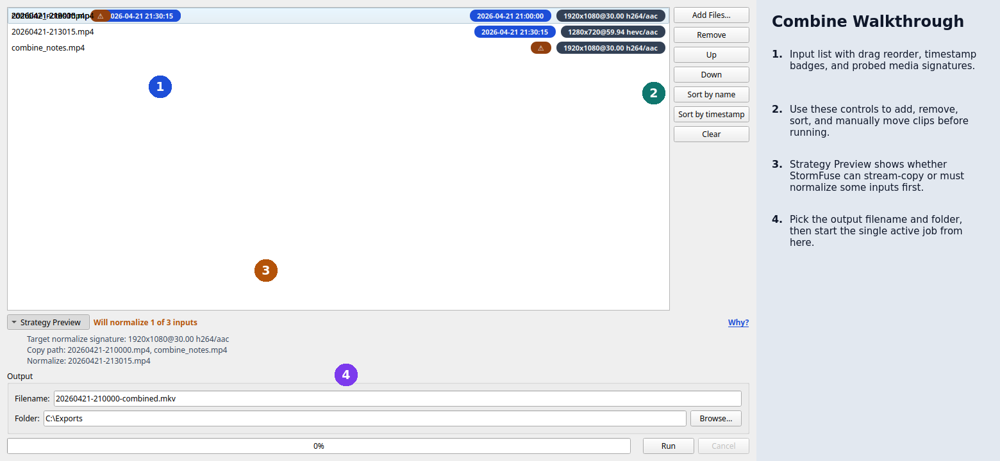
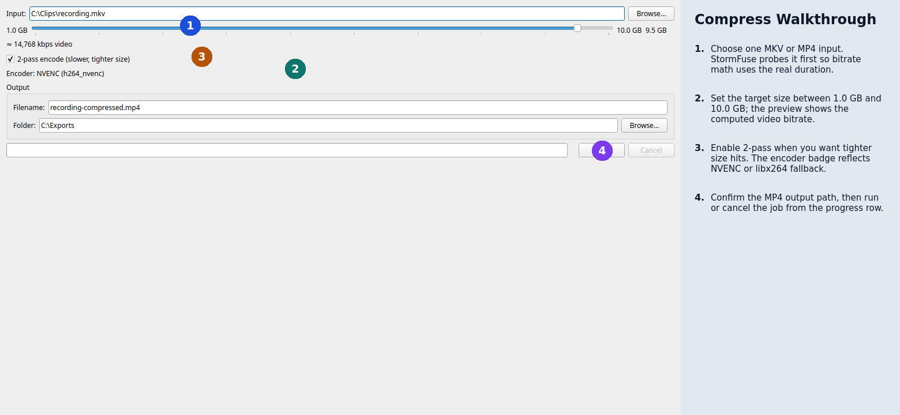

# StormFuse

StormFuse is a Windows desktop app that wraps bundled `ffmpeg` and `ffprobe` to do two jobs cleanly: combine multiple MKV/MP4 files into one output, and compress a single MKV/MP4 under a target size ceiling. It prefers NVIDIA NVENC when a working GPU path is available, falls back silently to `libx264` when it is not, and keeps detailed structured logs so failures are diagnosable.

## Workflows

| Workflow | What it does | Default output |
|----------|--------------|----------------|
| Combine | Joins multiple MKV/MP4 files. StormFuse stream-copies when inputs match, or normalizes mismatched inputs and then concatenates them. | `<first-input>-combined.mkv` |
| Compress | Re-encodes one MKV/MP4 to fit under a chosen size target from 1.0 GB to 10.0 GB. | `<input>-compressed.mp4` |

## Install

1. Download the latest `StormFuse-Setup-<version>.exe` from [GitHub Releases](https://github.com/jasmeralia/stormfuse/releases).
2. Run the installer.
3. Choose the per-user install option if you do not want an elevation prompt. Per-user install does not require admin rights.
4. Launch StormFuse from the Start Menu or desktop shortcut.

StormFuse ships its own pinned `ffmpeg.exe` and `ffprobe.exe`. It does not use `ffmpeg` from `PATH`.

## First Run

On startup, StormFuse does two checks before the main window is ready:

1. It locates the bundled `ffmpeg` and `ffprobe` binaries.
2. It probes NVENC in two stages: `ffmpeg -encoders` must list `h264_nvenc`, then a small 1-frame `256x256` encode must succeed.

The status bar shows the result plainly:

- `NVENC` means GPU encoding is available.
- `libx264` means StormFuse fell back to CPU encoding.

This fallback is informational, not fatal. If NVENC is unavailable, combine and compress still work.

Logs live here on Windows:

- `%LOCALAPPDATA%\\StormFuse\\logs\\latest.log`
- `%LOCALAPPDATA%\\StormFuse\\logs\\stormfuse-YYYYMMDD-HHMMSS-PID.log`

Useful log entry points:

- `Help > Open Logs`
- `Help > Clear Log Files`
- The bottom log pane, which mirrors the human-readable log stream live

## UI Walkthrough

### Combine



Use the Combine tab to:

- Add MKV/MP4 files, then sort by filename, sort by parsed timestamp, drag to reorder, or move rows with Up/Down.
- Review the strategy preview before running. If every input matches on video and audio signature, StormFuse uses stream-copy concat. Otherwise it normalizes only the mismatched inputs first.
- Choose an output filename and folder. The default output is an MKV next to the first input.

### Compress



Use the Compress tab to:

- Choose one MKV/MP4 input file.
- Set a target size from 1.0 GB to 10.0 GB. The default is 9.5 GB to leave headroom under the MFC Share 10 GB limit.
- Optionally enable 2-pass mode for tighter size targeting.
- Save to MP4 with AAC audio (`192 kbps`, stereo, `48 kHz`) and `+faststart`.

## Troubleshooting

### Reading `latest.log`

`latest.log` is JSON Lines: one JSON object per line. The most useful keys are:

- `event`: stable event name such as `nvenc.probe`, `ffmpeg.exit`, or `probe.error`
- `msg`: human-readable summary
- `ctx`: structured context, including argv lists, paths, and stderr excerpts where applicable

When a job fails, read the last few lines of `latest.log` and look for:

- `probe.error` if StormFuse could not inspect an input file
- `ffmpeg.exit` if ffmpeg exited non-zero
- `job.fail` for workflow-level failures such as an impossible target size
- `app.ffmpeg_missing` if the bundled binaries were not found

### Copying a diagnostic

Failure dialogs include a `Copy diagnostic` button. That bundle includes:

- App version
- OS
- Encoder state
- Event name
- Error message
- Stderr tail excerpt
- The current contents of `latest.log`

That is the fastest way to hand someone enough context to debug a failure.

### Common NVENC pitfalls

- `h264_nvenc` is not present in `ffmpeg -encoders`: StormFuse will use `libx264`.
- The driver or runtime encode test fails even though the encoder is listed: StormFuse logs the exact probe command and will use `libx264`.
- The machine changed state after launch: use the status-bar context menu action `Re-check NVENC`.

If NVENC keeps falling back unexpectedly, check `latest.log` for `nvenc.probe` and the recorded reason.

### Missing bundled ffmpeg

If StormFuse says the bundled binaries are missing:

- Installed copy: reinstall StormFuse.
- Source checkout: run `make fetch-ffmpeg`.

## Building From Source

StormFuse development goes through the `Makefile`.

| Command | Purpose |
|---------|---------|
| `make venv` | Create `.venv/` with Python 3.12 |
| `make deps` | Install runtime and development dependencies and editable package metadata |
| `make fetch-ffmpeg` | Download and verify the pinned gyan.dev ffmpeg build into `resources/ffmpeg/` |
| `make run` | Launch StormFuse from source |
| `make lintfix` | Run `ruff format` and `ruff check --fix` |
| `make lint` | Run `ruff`, `mypy`, and `pylint` |
| `make test` | Run the Linux-compatible unit suite |
| `make test-functional` | Run Windows-only functional tests |
| `make test-all` | Run unit and functional tests |
| `make installer` | Build the Windows installer |
| `make clean` | Remove generated build, test, and virtualenv artifacts |

Typical local setup:

```bash
make venv
make deps
make fetch-ffmpeg
make run
```

## Development

### Quality gates

Before landing a change:

1. Run `make lintfix`.
2. Run `make lint`.
3. Run `make test`.
4. Run `make test-functional` as well if you changed Windows-specific or subprocess behavior.

Unit tests are designed to run on Linux or WSL. The full app, installer, and functional suite are Windows-oriented.

### Adding a new encoder

Adding an encoder is a spec change, not just a code change. Do this in order:

1. Update `docs/DESIGN.md`, especially the encoder and ffmpeg sections.
2. Keep subprocess logic inside `src/stormfuse/ffmpeg/`; do not add subprocess usage to UI or job modules.
3. Extend `src/stormfuse/ffmpeg/encoders.py` with exact argv builders and detection behavior.
4. Add unit coverage in `tests/unit/test_encoders.py` and any needed workflow coverage.
5. Update user-facing docs if the new encoder changes UI, output, or troubleshooting.

## License

StormFuse is licensed under GPL v3. The repository root `LICENSE` file contains the canonical GPL-3.0 text.

Third-party license matrix:

| Component | License | Distribution posture |
|-----------|---------|----------------------|
| StormFuse | GPL-3.0 | Source + binary |
| PyQt6 | GPL-3.0 (Riverbank) | Imported module, compatible with GPL v3 app |
| FFmpeg (gyan.dev essentials build) | GPL-2.0 due to `libx264`/`libx265` | Shipped as separate `.exe` files and invoked via subprocess |
| PyInstaller | GPL with bootloader exception | Build tool only, not shipped |
| NSIS | zlib/libpng | Build tool only, not shipped |
| pytest / ruff / mypy / pylint | MIT / BSD | Dev-only |

Installer license artifacts live under `resources/licenses/`.

## Credits

- Python 3.12+
- PyQt6 by Riverbank Computing
- FFmpeg by the FFmpeg project, using the gyan.dev build
- PyInstaller and NSIS for packaging
- pytest, ruff, mypy, and pylint for development
- Developed with assistance from Claude (Anthropic) and Codex (OpenAI)
